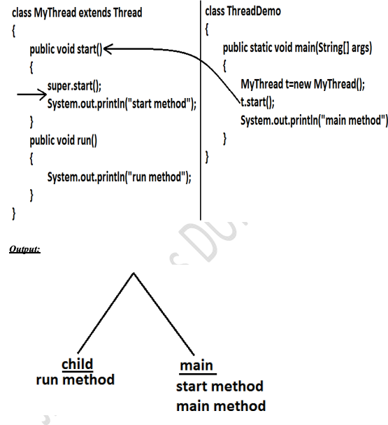
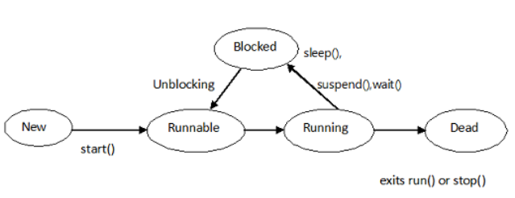

# **Java Essentials Guide**

---

## **1. Java Architecture**

Java operates on the principle of 'Write Once, Run Anywhere'. The architecture can be described as:

- **Java Source Code (.java files)**: Code written by developers.
- **Java Compiler**: Converts source code to bytecode.
- **Java Bytecode (.class files)**: The platform-independent intermediate code.
- **Java Virtual Machine (JVM)**: An abstract computing machine that runs bytecode. There's a specific JVM for each platform.

---

## **2. Java Buzzwords**

Java is characterized by several defining buzzwords:

- **Simple**: Intuitive and user-friendly.
- **Object-Oriented**: Java uses the OOP paradigm for organized, modular coding.
- **Platform Independent**: Code written in Java can run on any device with a JVM.
- **Secure**: Java comes fortified with inherent security features.
- **Architecture Neutral**: No architectural dependency ensures Java's portability.
- **Portable**: With JVM, bytecode is compatible with any OS or device.
- **Robust**: Equipped with robust memory management and error-handling capabilities.
- **Multithreaded**: Designed to execute several threads simultaneously.
- **High Performance**: Bytecode nearly matches the performance of native code.
- **Distributed**: Tailored for the internet's distributed environment.

---

## **3. Path and ClassPath Variables**

- **Path Variable**: This OS environment variable locates executable files. For Java, the Path variable ensures Java tools like `javac` and `java` run from any directory in the command line.
- **ClassPath Variable**: Point ClassPath to the directory or a JAR where .class files reside. The JVM uses ClassPath to locate and load classes during runtime.

---

## **4. Sample Java Program**

Here's a Java program that outputs "Hello, World!" on the console:

```java
public class HelloWorld {
    public static void main(String[] args) {
        System.out.println("Hello, World!");
    }
}
```

## **5. Compiling and Running Java Programs**

1. **Compiling**: Compile your Java source code using the `javac` command:
   ```bash
   javac HelloWorld.java

2. **Running**: Execute your Java program using the `java` command::
   ```bash
   javac HelloWorld.java

# **Java Essentials: Arrays & For-Each Loop**

---

## **1. Arrays**

Arrays in Java are homogeneous data structures that can store multiple values of the same type in contiguous memory locations.

### **Declaration**:
You can declare an array by specifying its type followed by square brackets.
```java
int[] arrayName;
```

### **Initialization**:
Arrays can be initialized at the time of declaration or using the `new` keyword.
```java
int[] numbers = {1, 2, 3, 4, 5}; // during declaration
numbers = new int[5]; 
            // using new keyword
```


### **MultiThreading**:

Executing several tasks simultaneously where each task is a separate independent part
of the same program, is called Thread based multitasking.
And each independent part is called a "Thread". 

```


class MyThread extends Thread {
	public void run() {
		for (int i = 0; i < 10; i++) {
			System.out.println("Child Thread");
		}

	}
}

public class ThreadDemo {
	public static void main(String[] args) {
		MyThread t = new MyThread();// Instantiation of a Thread
		t.start();// starting of a Thread
		for (int i = 0; i < 5; i++) {
			System.out.println("main thread");
		}
	}
}

```

```
main thread
main thread
Child Thread
Child Thread
Child Thread
main thread
main thread
main thread
Child Thread
Child Thread
Child Thread
Child Thread
Child Thread
Child Thread
Child Thread

```

### **Case 1: Thread Scheduler:**
 If multiple Threads are waiting to execute then which Thread will execute 1st is
decided by "Thread Scheduler" which is part of JVM.

 Which algorithm or behavior followed by Thread Scheduler we can't expect
exactly it is the JVM vendor dependent hence in multithreading examples we
can't expect exact execution order and exact output.

### **Case 2: Difference between t.start() and t.run() methods.**
 In the case of t.start() a new Thread will be created which is responsible for the
execution of run() method.

 But in the case of t.run() no new Thread will be created and run() method will be
executed just like a normal method by the main Thread.

 In the above program if we are replacing t.start() with t.run() the following is the
output.

### **Case 3: importance of Thread class start() method.**
For every Thread the required mandatory activities like registering the Thread with
Thread Scheduler will takes care by Thread class start() method and programmer is
responsible just to define the job of the Thread inside run() method.
That is start() method acts as best assistant to the programmer.

Example:
start()
{
1. Register Thread with Thread Scheduler
2. All other mandatory low level activities.
3. Invoke or calling run() method.
}

We can conclude that without executing Thread class start() method there is no chance
of starting a new Thread in java. Due to this start() is considered as heart of
multithreading. 

### **Case 4: If we are not overriding run() method:**
If we are not overriding run() method then Thread class run() method will be executed
which has empty implementation and hence we won't get any output.

Example:
```
class MyThread extends Thread {
}

class ThreadDemo {
	public static void main(String[] args) {
		MyThread t = new MyThread();
		t.start();
	}
}
```
It is highly recommended to override run() method. Otherwise don't go for
multithreading concept




### **Life Cycle of a Thread** 

There are multiple states of the thread in a lifecycle as mentioned below:



```
1. New Thread: When a new thread is created, it is in the new state. The thread has not yet started to run when the thread is in this state. When a thread lies in the new state, its code is yet to be run and hasn’t started to execute.

2. Runnable State: A thread that is ready to run is moved to a runnable state. In this state, a thread might actually be running or it might be ready to run at any instant of time. It is the responsibility of the thread scheduler to give the thread, time to run. 
A multi-threaded program allocates a fixed amount of time to each individual thread. Each and every thread runs for a short while and then pauses and relinquishes the CPU to another thread so that other threads can get a chance to run. When this happens, all such threads that are ready to run, waiting for the CPU and the currently running thread lie in a runnable state.

3. Blocked/Waiting state: When a thread is temporarily inactive, then it’s in one of the following states: 
Blocked
Waiting

4. Timed Waiting: A thread lies in a timed waiting state when it calls a method with a time-out parameter. A thread lies in this state until the timeout is completed or until a notification is received. For example, when a thread calls sleep or a conditional wait, it is moved to a timed waiting state.

5. Terminated State: A thread terminates because of either of the following reasons: 
Because it exits normally. This happens when the code of the thread has been entirely executed by the program.
Because there occurred some unusual erroneous event, like a segmentation fault or an unhandled exception.
```

### **Writing  Multithreaded  Programs**

```
class MyThread extends Thread {
    public void run() {
        System.out.println("Thread is running.");
    }

    public static void main(String args[]) {
        MyThread t1 = new MyThread();
        t1.start();
    }
}

```

```
class MyRunnable implements Runnable {
    public void run() {
        System.out.println("Runnable is running.");
    }

    public static void main(String args[]) {
        Thread t1 = new Thread(new MyRunnable());
        t1.start();
    }
}
```

## Java Thread Properties

### **1. Name**
Every thread has a name, primarily used for debugging.
- **Get**: `getName()`
- **Set**: `setName(String name)`

### **2. Priority**
Threads operate with priorities from `Thread.MIN_PRIORITY` to `Thread.MAX_PRIORITY`.
- **Get**: `getPriority()`
- **Set**: `setPriority(int newPriority)`

### **3. Thread ID**
Every thread is given a unique ID.
- **Get**: `getId()`

### **4. State**
This denotes the current lifecycle stage of the thread.
- **Get**: `getState()`
- **Possible States**: 
  - NEW
  - RUNNABLE
  - BLOCKED
  - WAITING
  - TIMED_WAITING
  - TERMINATED

### **5. Thread Group**
All threads belong to a thread group.
- **Get**: `getThreadGroup()`

### **6. Daemon Status**
Daemon threads work in the background to support user threads.
- **Check**: `isDaemon()`
- **Set**: `setDaemon(boolean isDaemon)`

### **7. Interrupted Status**
This indicates if a thread has been interrupted.
- **Interrupt**: `interrupt()`
- **Check**: `isInterrupted()`
- **Static Check**: `Thread.interrupted()`

### **8. Stack Trace**
You can fetch the current stack trace for debugging.
- **Get**: `getStackTrace()`

### **9. Context ClassLoader**
Class loaders are vital for dynamically loading classes.
- **Get**: `getContextClassLoader()`
- **Set**: `setContextClassLoader(ClassLoader cl)`

### **10. Uncaught Exception Handler**
Handles exceptions that aren't caught.
- **Get**: `getUncaughtExceptionHandler()`
- **Set**: `setUncaughtExceptionHandler(Thread.UncaughtExceptionHandler eh)`

## **The Method to Prevent from Execution**

## `yield()` Method

### Properties:

- **Static Method**: This method belongs to the `Thread` class.
- **Thread Scheduler**: It's a hint to the thread scheduler in the JVM that the current thread is willing to yield its current use of the CPU.
- **Execution Control**: The current thread might still continue executing if no other threads are available to run.

### Example:

```java
public class YieldExample extends Thread {
    public void run() {
        for (int i = 0; i < 5; i++) {
            System.out.println(Thread.currentThread().getName() + " in control");
        }
    }

    public static void main(String[] args) {
        YieldExample t1 = new YieldExample();
        YieldExample t2 = new YieldExample();

        t1.start();
        Thread.yield();
        t2.start();
    }
}
```

## `join()` Method

### Properties:

- **Waiting for Completion**: Allows one thread to wait until another thread completes its execution.
- **Ordering**: Can ensure that one thread completes before another starts.

### Example:

```java
public class JoinExample extends Thread {
    public void run() {
        for (int i = 1; i <= 5; i++) {
            try {
                Thread.sleep(500);
            } catch (InterruptedException e) {
                System.out.println(e);
            }
            System.out.println(i);
        }
    }

    public static void main(String[] args) {
        JoinExample t1 = new JoinExample();
        JoinExample t2 = new JoinExample();
        JoinExample t3 = new JoinExample();

        t1.start();
        try {
            t1.join();
        } catch (InterruptedException e) {
            System.out.println(e);
        }

        t2.start();
        t3.start();
    }
}
```

## `sleep()` Method

### Properties:

- **Static Method**: This method belongs to the `Thread` class.
- **Pause Execution**: Makes the current thread sleep (or pause) for a specified number of milliseconds.
- **Thread State**: During the sleep duration, the thread is in a blocked state. 

### Example:

```java
public class SleepExample extends Thread {
    public void run() {
        for (int i = 1; i <= 5; i++) {
            try {
                Thread.sleep(1000);
            } catch (InterruptedException e) {
                System.out.println(e);
            }
            System.out.println(i);
        }
    }

    public static void main(String[] args) {
        SleepExample t1 = new SleepExample();
        SleepExample t2 = new SleepExample();

        t1.start();
        t2.start();
    }
}

```
### **Synchronization**

1. Synchronized is the keyword applicable for methods and blocks but not for
classes and variables.

2. If a method or block declared as the synchronized then at a time only one
Thread is allow to execute that method or block on the given object.

3. The main advantage of synchronized keyword is we can resolve date
inconsistency problems.

4. But the main disadvantage of synchronized keyword is it increases waiting time
of the Thread and effects performance of the system.

5. Hence if there is no specific requirement then never recommended to use
synchronized keyword.

6. Internally synchronization concept is implemented by using lock concept.

7. Every object in java has a unique lock. Whenever we are using synchronized
keyword then only lock concept will come into the picture.

8. If a Thread wants to execute any synchronized method on the given object 1st it
has to get the lock of that object. Once a Thread got the lock of that object then
it's allow to execute any synchronized method on that object. If the synchronized
method execution completes then automatically Thread releases lock.

9. While a Thread executing any synchronized method the remaining Threads are
not allowed execute any synchronized method on that object simultaneously. But
remaining Threads are allowed to execute any non-synchronized method
simultaneously. [lock concept is implemented based on object but not based on
method].


### **File IO**

Java's IO package provides classes to perform file operations. Here are the primary classes for file handling:

## Byte Stream Classes

- **FileInputStream**: Used to read binary data from a file.
- **FileOutputStream**: Used to write binary data to a file.

# FileInputStream in Java

`FileInputStream` is part of Java's IO package (`java.io`). It's used for reading binary data from a file. It's essentially a stream that is connected to a file to read bytes of data. This makes it suitable for reading binary files such as images, audio files, or any files that require byte-level operations.

## How to use FileInputStream?

To use `FileInputStream`, you generally:

1. Create an instance of the class, passing the file's path or a `File` object to its constructor.
2. Use the `read()` method to retrieve data. The method returns an `int` value, which is either the next byte of data or `-1` if the end of the file is reached.
3. Always close the stream after you're done using it.

## Example

Below is a simple example demonstrating the use of `FileInputStream` to read the contents of a file:

```java
import java.io.FileInputStream;
import java.io.IOException;

public class FileInputStreamExample {
    public static void main(String[] args) {
        try {
            FileInputStream fis = new FileInputStream("example.txt");
            
            int data;
            while ((data = fis.read()) != -1) {
                System.out.print((char) data);
            }
            
            fis.close();
        } catch (IOException e) {
            e.printStackTrace();
        }
    }
}
```

# FileOutputStream in Java

`FileOutputStream` is a class from Java's IO package (`java.io`). It's designed for writing binary data to a file. Whether you're working with text files or binary files like images, you can use `FileOutputStream` to write data byte-by-byte to the file.

## How to use FileOutputStream?

To use `FileOutputStream`, follow these steps:

1. Create an instance of the class, specifying the file's path or a `File` object in its constructor.
2. Use the `write()` method to write data. You can write a single byte, a subset of a byte array, or an entire byte array.
3. Always ensure you close the stream after writing to release resources.

## Example

Here's a simple example that demonstrates the use of `FileOutputStream` to write a string to a file:

```java
import java.io.FileOutputStream;
import java.io.IOException;

public class FileOutputStreamExample {
    public static void main(String[] args) {
        String content = "Hello, FileOutputStream!";

        try {
            FileOutputStream fos = new FileOutputStream("output.txt");
            
            // Convert string to byte array and write to file
            fos.write(content.getBytes());
            
            fos.close();
            System.out.println("Data written to the file successfully!");
        } catch (IOException e) {
            e.printStackTrace();
        }
    }
}
```

## Character Stream Classes

- **FileReader**: Used for reading character data from a file.
- **FileWriter**: Used for writing character data to a file.

## Random Access

- **RandomAccessFile**: Allows reading and writing operations at any position within the file.


# FileReader in Java

`FileReader` is a class from Java's IO package (`java.io`). Unlike `FileInputStream`, which is byte-oriented, `FileReader` is character-oriented, making it ideal for reading text files. It reads text from character streams, handling the encoding conversion from bytes to characters internally.

## How to use FileReader?

To effectively utilize `FileReader`:

1. Instantiate the class, providing the file's path or a `File` object to its constructor.
2. Use the `read()` method to retrieve character data. This method returns an `int` value, representing the next character's Unicode code, or `-1` if the end of the file is reached.
3. Always remember to close the stream after use to free up system resources.

## Example

Here's an illustrative example showcasing the use of `FileReader` to read content from a text file:

```java
import java.io.FileReader;
import java.io.IOException;

public class FileReaderExample {
    public static void main(String[] args) {
        try {
            FileReader fr = new FileReader("textfile.txt");
            
            int character;
            while ((character = fr.read()) != -1) {
                System.out.print((char) character);
            }
            
            fr.close();
        } catch (IOException e) {
            e.printStackTrace();
        }
    }
}
```

# FileWriter in Java

`FileWriter` is part of Java's IO package (`java.io`). Similar to `FileReader`, the `FileWriter` class is character-oriented, making it a great fit for writing text files. It writes text to character streams, taking care of the encoding conversion from characters to bytes internally.

## How to use FileWriter?

When working with `FileWriter`:

1. Instantiate the class, providing either the path of the file or a `File` object as a parameter to its constructor.
2. Use the `write()` method to write character data. This can be a single character, a substring, or an entire string.
3. Always close the stream after you're finished writing to release system resources. Alternatively, use try-with-resources for automatic closure.

## Example

Here's a simple example that demonstrates the use of `FileWriter` to write content to a text file:

```java
import java.io.FileWriter;
import java.io.IOException;

public class FileWriterExample {
    public static void main(String[] args) {
        String content = "Hello, FileWriter!";

        try (FileWriter fw = new FileWriter("output.txt")) {            
            fw.write(content);            
            System.out.println("Content written to the file successfully!");
        } catch (IOException e) {
            e.printStackTrace();
        }
    }
}
```

# RandomAccessFile in Java

The `RandomAccessFile` class, part of the Java IO package (`java.io`), allows for both reading and writing to specific positions within a file. Unlike other stream classes that provide sequential access, `RandomAccessFile` provides methods to move the file pointer to a specific position, making random or non-sequential file access possible.

## Key Features

- **Random Access**: You can both read from and write to any part of a file.
- **Combined Operations**: It allows both input and output operations on the same file.
- **Flexible Pointer Movement**: The file pointer can be moved forwards and backward.

## How to use RandomAccessFile?

1. Instantiate the class by specifying the file's path and mode (e.g., "r" for read-only and "rw" for read and write).
2. Use methods like `seek()` to set the file pointer to a specific position.
3. Use `read()` and `write()` methods to perform IO operations.
4. Close the file when done.

## Example

Here's an illustrative example showcasing the use of `RandomAccessFile`:

```java
import java.io.RandomAccessFile;
import java.io.IOException;

public class RandomAccessFileExample {
    public static void main(String[] args) {
        try (RandomAccessFile raf = new RandomAccessFile("data.txt", "rw")) {
            
            // Write data to file
            raf.writeUTF("Hello, RandomAccessFile!");

            // Move the file pointer to the beginning
            raf.seek(0);

            // Read the data from file
            String data = raf.readUTF();
            System.out.println(data);

        } catch (IOException e) {
            e.printStackTrace();
        }
    }
}
```