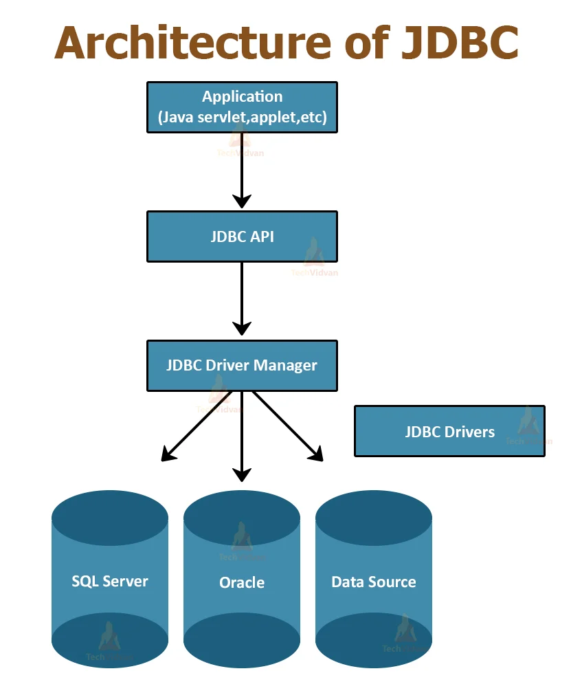

## JDBC Architecture

Java Database Connectivity (JDBC) is a Java-based API that allows Java programs to interact with databases. The JDBC architecture consists of a set of classes and interfaces written in the Java programming language. 

### Components of JDBC:

1. **JDBC API**: Provides application-to-JDBC Manager connections.
2. **JDBC Driver API**: Supports JDBC Manager-to-Driver connections.
3. **JDBC Drivers**: 
    - **Type-1 driver**: JDBC-ODBC bridge driver.
    - **Type-2 driver**: Native-API driver.
    - **Type-3 driver**: Network Protocol driver.
    - **Type-4 driver**: Thin driver.

### Architecture Layers:

1. **JDBC Application**: The user's application that makes use of the JDBC API.
2. **JDBC API**: Set of interfaces and classes provided by Java.
3. **JDBC Driver Manager**: Ensures the correct driver is called for each DBMS.
4. **JDBC Drivers**: Interface implementations for specific database systems. Translates requests from Java format to a format understandable by the database.
5. **Database**: The actual database where data is stored and retrieved from.

### Flow:

1. **Connection Establishment**: Application uses the JDBC API to request a connection from the DriverManager. The DriverManager then uses a driver to establish a database connection.
2. **Creating Statements**: Once connected, the application can create one or more Statement objects to send SQL commands to the database.
3. **Executing Queries**: Using the Statement object, the application can execute SQL queries against the database.
4. **Returning Results**: After executing queries, results are returned. If the result is a ResultSet (e.g., from a SELECT query), the application iterates over the results using appropriate JDBC methods.
5. **Closing Connection**: Once done, the application should close the connection to free up resources.

### Example:

Here's a simple example of a JDBC connection to a hypothetical database:

```java
import java.sql.*;

public class JDBCArchitectureExample {
    public static void main(String[] args) {
        String url = "jdbc:some_db://localhost:3306/some_database";
        String user = "username";
        String password = "password";

        try (Connection connection = DriverManager.getConnection(url, user, password)) {
            Statement statement = connection.createStatement();
            ResultSet resultSet = statement.executeQuery("SELECT * FROM some_table");

            while (resultSet.next()) {
                System.out.println(resultSet.getString("column_name"));
            }
        } catch (SQLException e) {
            e.printStackTrace();
        }
    }
}
```




## Types of JDBC Drivers

JDBC drivers are essential components in the JDBC architecture that facilitate the communication between a Java application and a database. There are primarily four types of JDBC drivers:

### 1. **Type-1 Driver (JDBC-ODBC Bridge Driver)**
- **Description**: This driver uses the ODBC driver to connect to the database. It translates JDBC method calls into ODBC function calls. This type of driver is generally considered the least efficient among all driver types.
- **Pros**:
    - Can connect to any database, given that an ODBC driver exists.
- **Cons**:
    - Performance overhead since it requires translation from JDBC to ODBC.
    - Not suitable for applets because it requires an ODBC driver to be installed on the client side.
    - Deprecated in Java 8 and removed in later versions.

### 2. **Type-2 Driver (Native-API Driver)**
- **Description**: This driver is platform-specific and uses the database's native client libraries. It converts JDBC calls directly into database-specific calls.
- **Pros**:
    - Faster than Type-1 driver since it doesn't require translation to ODBC.
- **Cons**:
    - Not truly Java as it uses native methods to connect.
    - Platform dependent and requires database-specific native libraries.

### 3. **Type-3 Driver (Network Protocol Driver)**
- **Description**: This driver translates JDBC calls into a database-independent network protocol which is then translated to a database protocol by a server. This server-side component can connect to multiple types of databases.
- **Pros**:
    - No client-side libraries required.
    - Can be used to create three-tier architectures.
    - Truly Java-based and is database agnostic.
- **Cons**:
    - Requires setup and maintenance of additional network server component.

### 4. **Type-4 Driver (Thin Driver)**
- **Description**: This driver is a pure Java driver that communicates directly with the database using the database's network protocol. It doesn't require native libraries.
- **Pros**:
    - Platform-independent and implemented in pure Java.
    - Often provides better performance than other driver types.
- **Cons**:
    - Specific to a database, meaning different databases require different Type-4 drivers.

Each of these driver types has its own advantages and disadvantages, and the choice depends on the specific needs of the application and infrastructure constraints.

## DDL and DML Operations using Java

Using JDBC (Java Database Connectivity), we can execute both DDL and DML statements on a database. Here are examples for each:

### Setup

Before executing any DDL or DML commands, we need to establish a connection to the database:

```java
import java.sql.Connection;
import java.sql.DriverManager;
import java.sql.Statement;

public class JDBCExample {
    private static final String JDBC_URL = "jdbc:mysql://localhost:3306/sampledb";
    private static final String JDBC_USER = "root";
    private static final String JDBC_PASSWORD = "password";

    public static void main(String[] args) {
        try (Connection conn = DriverManager.getConnection(JDBC_URL, JDBC_USER, JDBC_PASSWORD);
             Statement stmt = conn.createStatement()) {

            // DDL and DML operations go here...

        } catch (Exception e) {
            e.printStackTrace();
        }
    }
}
```


## Creating a Table using DDL in Java with JDBC

Using Java's JDBC API, we can connect to a relational database and execute DDL operations such as creating a table. Let's see a step-by-step example of how to create a table.


### Code to Create a Table

```
import java.sql.Connection;
import java.sql.DriverManager;
import java.sql.Statement;

public class CreateTableExample {

    private static final String JDBC_URL = "jdbc:mysql://localhost:3306/sampledb";
    private static final String JDBC_USER = "root";
    private static final String JDBC_PASSWORD = "password";

    public static void main(String[] args) {
        try (Connection conn = DriverManager.getConnection(JDBC_URL, JDBC_USER, JDBC_PASSWORD);
             Statement stmt = conn.createStatement()) {
             
            String createTableSQL = """
                CREATE TABLE employees (
                    id INT(6) UNSIGNED AUTO_INCREMENT PRIMARY KEY,
                    firstName VARCHAR(30) NOT NULL,
                    lastName VARCHAR(30) NOT NULL,
                    age INT(3) NOT NULL,
                    joinDate DATE
                )
                """;

            stmt.execute(createTableSQL);
            System.out.println("Table 'employees' created successfully.");

        } catch (Exception e) {
            e.printStackTrace();
        }
    }
}


```

## Altering a Table using DDL in Java with JDBC

Once a table is created in a database, there might be scenarios where you'd need to modify its structure, like adding a new column, deleting an existing column, or changing the datatype of a column. JDBC provides a way to do this in Java using the `ALTER TABLE` command.
```
import java.sql.Connection;
import java.sql.DriverManager;
import java.sql.Statement;

public class AlterTableExample {

    private static final String JDBC_URL = "jdbc:mysql://localhost:3306/sampledb";
    private static final String JDBC_USER = "root";
    private static final String JDBC_PASSWORD = "password";

    public static void main(String[] args) {
        try (Connection conn = DriverManager.getConnection(JDBC_URL, JDBC_USER, JDBC_PASSWORD);
             Statement stmt = conn.createStatement()) {
             
            String alterTableSQL = "ALTER TABLE employees ADD email VARCHAR(50)";

            stmt.execute(alterTableSQL);
            System.out.println("Table 'employees' altered successfully to add 'email' column.");

        } catch (Exception e) {
            e.printStackTrace();
        }
    }
}
```

## Dropping a Table using DDL in Java with JDBC

Dropping a table means deleting the table from the database entirely. This operation will remove the table structure as well as the data it contains. Using Java's JDBC API, you can easily drop a table from a database.

```
import java.sql.Connection;
import java.sql.DriverManager;
import java.sql.Statement;

public class DropTableExample {

    private static final String JDBC_URL = "jdbc:mysql://localhost:3306/sampledb";
    private static final String JDBC_USER = "root";
    private static final String JDBC_PASSWORD = "password";

    public static void main(String[] args) {
        try (Connection conn = DriverManager.getConnection(JDBC_URL, JDBC_USER, JDBC_PASSWORD);
             Statement stmt = conn.createStatement()) {
             
            String dropTableSQL = "DROP TABLE employees";

            stmt.execute(dropTableSQL);
            System.out.println("Table 'employees' dropped successfully.");

        } catch (Exception e) {
            e.printStackTrace();
        }
    }
}

```
## Executing a SELECT Query using Java with JDBC

Using Java's JDBC API, you can easily fetch data from a database using the `SELECT` SQL statement.
```
import java.sql.Connection;
import java.sql.DriverManager;
import java.sql.ResultSet;
import java.sql.Statement;

public class SelectQueryExample {

    private static final String JDBC_URL = "jdbc:mysql://localhost:3306/sampledb";
    private static final String JDBC_USER = "root";
    private static final String JDBC_PASSWORD = "password";

    public static void main(String[] args) {
        try (Connection conn = DriverManager.getConnection(JDBC_URL, JDBC_USER, JDBC_PASSWORD);
             Statement stmt = conn.createStatement()) {
             
            String selectSQL = "SELECT * FROM employees";

            ResultSet rs = stmt.executeQuery(selectSQL);
            while (rs.next()) {
                int id = rs.getInt("id");
                String name = rs.getString("name");
                String email = rs.getString("email");
                
                System.out.printf("ID: %d, Name: %s, Email: %s%n", id, name, email);
            }

        } catch (Exception e) {
            e.printStackTrace();
        }
    }
}
```

## Inserting Data into a Database using Java with JDBC

Using Java's JDBC API, you can easily insert data into a database. Here's how to do it:
```
import java.sql.Connection;
import java.sql.DriverManager;
import java.sql.Statement;

public class InsertQueryStatementExample {

    private static final String JDBC_URL = "jdbc:mysql://localhost:3306/sampledb";
    private static final String JDBC_USER = "root";
    private static final String JDBC_PASSWORD = "password";

    public static void main(String[] args) {
        try (Connection conn = DriverManager.getConnection(JDBC_URL, JDBC_USER, JDBC_PASSWORD);
             Statement stmt = conn.createStatement()) {

            String insertSQL = "INSERT INTO employees (name, email) VALUES ('John Doe', 'john.doe@example.com')";
            
            int rowsAffected = stmt.executeUpdate(insertSQL);
            if (rowsAffected > 0) {
                System.out.println("Data successfully inserted!");
            }

        } catch (Exception e) {
            e.printStackTrace();
        }
    }
}

```
## Updating Data in a Database using Java with JDBC (Using Statement)


```
import java.sql.Connection;
import java.sql.DriverManager;
import java.sql.Statement;

public class UpdateQueryStatementExample {

    private static final String JDBC_URL = "jdbc:mysql://localhost:3306/sampledb";
    private static final String JDBC_USER = "root";
    private static final String JDBC_PASSWORD = "password";

    public static void main(String[] args) {
        try (Connection conn = DriverManager.getConnection(JDBC_URL, JDBC_USER, JDBC_PASSWORD);
             Statement stmt = conn.createStatement()) {

            String updateSQL = "UPDATE employees SET email = 'john.updated@example.com' WHERE name = 'John Doe'";
            
            int rowsAffected = stmt.executeUpdate(updateSQL);
            if (rowsAffected > 0) {
                System.out.println("Data successfully updated!");
            } else {
                System.out.println("No rows updated. Please ensure the WHERE clause matches existing data.");
            }

        } catch (Exception e) {
            e.printStackTrace();
        }
    }
}

```

## Deleting Data from a Database using Java with JDBC (Using Statement)

```
import java.sql.Connection;
import java.sql.DriverManager;
import java.sql.Statement;

public class DeleteQueryStatementExample {

    private static final String JDBC_URL = "jdbc:mysql://localhost:3306/sampledb";
    private static final String JDBC_USER = "root";
    private static final String JDBC_PASSWORD = "password";

    public static void main(String[] args) {
        try (Connection conn = DriverManager.getConnection(JDBC_URL, JDBC_USER, JDBC_PASSWORD);
             Statement stmt = conn.createStatement()) {

            String deleteSQL = "DELETE FROM employees WHERE name = 'John Doe'";
            
            int rowsAffected = stmt.executeUpdate(deleteSQL);
            if (rowsAffected > 0) {
                System.out.println("Data successfully deleted!");
            } else {
                System.out.println("No rows deleted. Please ensure the WHERE clause matches existing data.");
            }

        } catch (Exception e) {
            e.printStackTrace();
        }
    }
}

```
## Using PreparedStatement in JDBC

`PreparedStatement` in JDBC offers several advantages over `Statement`, primarily in terms of security and performance. Here, we'll cover CRUD operations using `PreparedStatement`.


```

import java.sql.*;

public class InsertPreparedStatement {
    public static void main(String[] args) {
        String JDBC_URL = "jdbc:mysql://localhost:3306/sampledb";
        String JDBC_USER = "root";
        String JDBC_PASSWORD = "password";

        try (Connection conn = DriverManager.getConnection(JDBC_URL, JDBC_USER, JDBC_PASSWORD);
             PreparedStatement pstmt = conn.prepareStatement("INSERT INTO employees (name, age) VALUES (?, ?)")) {
             
            pstmt.setString(1, "John Doe");
            pstmt.setInt(2, 30);
            
            int rowsAffected = pstmt.executeUpdate();
            System.out.println(rowsAffected + " rows inserted.");

        } catch (SQLException e) {
            e.printStackTrace();
        }
    }
}


// ... [Initial setup remains the same]

try (Connection conn = DriverManager.getConnection(JDBC_URL, JDBC_USER, JDBC_PASSWORD);
     PreparedStatement pstmt = conn.prepareStatement("UPDATE employees SET age = ? WHERE name = ?")) {
         
    pstmt.setInt(1, 31);
    pstmt.setString(2, "John Doe");
    
    int rowsAffected = pstmt.executeUpdate();
    System.out.println(rowsAffected + " rows updated.");

} catch (SQLException e) {
    e.printStackTrace();
}


// ... [Initial setup remains the same]

try (Connection conn = DriverManager.getConnection(JDBC_URL, JDBC_USER, JDBC_PASSWORD);
     PreparedStatement pstmt = conn.prepareStatement("DELETE FROM employees WHERE name = ?")) {
         
    pstmt.setString(1, "John Doe");
    
    int rowsAffected = pstmt.executeUpdate();
    System.out.println(rowsAffected + " rows deleted.");

} catch (SQLException e) {
    e.printStackTrace();
}


```


```

import java.sql.*;

public class MultipleResultsExample {
    public static void main(String[] args) {
        String JDBC_URL = "jdbc:mysql://localhost:3306/sampledb";
        String JDBC_USER = "root";
        String JDBC_PASSWORD = "password";

        try (Connection conn = DriverManager.getConnection(JDBC_URL, JDBC_USER, JDBC_PASSWORD);
             CallableStatement cstmt = conn.prepareCall("{call my_stored_procedure()}")) {
             
            boolean hasResults = cstmt.execute();
            
            while (hasResults) {
                ResultSet rs = cstmt.getResultSet();
                while (rs.next()) {
                    // Process the current ResultSet data, for example:
                    String name = rs.getString("name");
                    int age = rs.getInt("age");
                    System.out.println("Name: " + name + ", Age: " + age);
                }
                
                // Check for more ResultSets
                hasResults = cstmt.getMoreResults();
            }

        } catch (SQLException e) {
            e.printStackTrace();
        }
    }
}


-- Creating a sample database
CREATE DATABASE sampledb;

-- Using the sample database
USE sampledb;

-- Creating a sample table named 'users'
CREATE TABLE users (
    id INT AUTO_INCREMENT PRIMARY KEY,
    name VARCHAR(50),
    age INT,
    email VARCHAR(100)
);


-- Inserting sample data
INSERT INTO users (name, age, email) VALUES 
('John', 25, 'john@example.com'),
('Jane', 28, 'jane@example.com'),
('Doe', 22, 'doe@example.com');


-- Creating the stored procedure
DELIMITER //

CREATE PROCEDURE my_stored_procedure()
BEGIN
    -- First ResultSet: names and ages
    SELECT name, age FROM users;

    -- Second ResultSet: names and emails
    SELECT name, email FROM users;
END //

DELIMITER ;

```

### Introduction to Scrollable ResultSet
In JDBC, a `ResultSet` object provides methods for retrieving data from the result set generated by running a query through an SQL statement. However, traditional ResultSet objects have limitations.

### Problems with Traditional ResultSet
1. `Unidirectional Navigation:` You can only traverse the data in a forward direction. If you've processed a row, there's no way to go back and reprocess or check it without rerunning the entire query.

2. `No Absolute Positioning:` If you want to directly access the nth row, you can't do it without iterating through the previous rows.

3. `Limited Flexibility:` Due to the above restrictions, the ResultSet provides restricted flexibility for complex data processing tasks.

Example of Traditional ResultSet Limitation:

```
import java.sql.*;

public class TraditionalResultSetExample {
    public static void main(String[] args) {
        String JDBC_URL = "jdbc:mysql://localhost:3306/sampledb";
        String JDBC_USER = "root";
        String JDBC_PASSWORD = "password";

        try (Connection conn = DriverManager.getConnection(JDBC_URL, JDBC_USER, JDBC_PASSWORD);
             Statement stmt = conn.createStatement()) {
             
            ResultSet rs = stmt.executeQuery("SELECT * FROM users");

            while (rs.next()) {
                System.out.println(rs.getString("name"));
            }

            // This will throw an exception because the traditional ResultSet is forward-only
            // rs.previous(); 

        } catch (SQLException e) {
            e.printStackTrace();
        }
    }
}

```

### Enter Scrollable ResultSet
A Scrollable ResultSet addresses these limitations. Here's how:

1. `Bidirectional Navigation:` You can move the cursor both forward and backward, allowing you to revisit rows.

2. `Absolute and Relative Positioning:` You can move the cursor to an absolute row number or move it relative to its current position.

3. `Flexible Iteration:` Scrollable ResultSets let you iterate over the data as needed, providing more flexibility for data processing tasks.

```

import java.sql.*;

public class ScrollableResultSetExample {
    public static void main(String[] args) {
        String JDBC_URL = "jdbc:mysql://localhost:3306/sampledb";
        String JDBC_USER = "root";
        String JDBC_PASSWORD = "password";

        try (Connection conn = DriverManager.getConnection(JDBC_URL, JDBC_USER, JDBC_PASSWORD);
             Statement stmt = conn.createStatement(ResultSet.TYPE_SCROLL_INSENSITIVE, ResultSet.CONCUR_READ_ONLY)) {
             
            ResultSet rs = stmt.executeQuery("SELECT * FROM users");

            // Moving cursor to 3rd row
            rs.absolute(3);
            System.out.println("Third row: " + rs.getString("name"));

            // Moving cursor one row backward
            rs.previous();
            System.out.println("Second row: " + rs.getString("name"));

        } catch (SQLException e) {
            e.printStackTrace();
        }
    }
}

```

### Introduction to Updateable ResultSet
The JDBC API provides the capability to update rows in a database table using the `ResultSet` object itself. Traditionally, `ResultSet` objects are read-only; however, JDBC allows you to create updateable `ResultSets`, which can be used to make changes to the underlying database.

#### Advantages of Updateable ResultSet
1. `Simplified Code:` No need to write separate SQL queries to update database tables. Direct changes can be made to the ResultSet, and those will reflect in the database.

2. `Dynamic Updates:` Based on certain conditions or logic, you can decide on-the-fly if a particular row needs to be updated, without having to re-fetch data or execute another SQL query.

Limitations
1. `Performance Concerns:` Updateable ResultSet might be slower as compared to executing direct SQL update queries, especially when dealing with large amounts of data.

2. `Concurrency Issues:` If multiple applications or parts of an application try to update the database simultaneously using an updateable ResultSet, there can be concurrency issues.


```

import java.sql.*;

public class UpdateableResultSetExample {
    public static void main(String[] args) {
        String JDBC_URL = "jdbc:mysql://localhost:3306/sampledb";
        String JDBC_USER = "root";
        String JDBC_PASSWORD = "password";

        try (Connection conn = DriverManager.getConnection(JDBC_URL, JDBC_USER, JDBC_PASSWORD);
             Statement stmt = conn.createStatement(ResultSet.TYPE_SCROLL_SENSITIVE, ResultSet.CONCUR_UPDATABLE)) {
             
            ResultSet rs = stmt.executeQuery("SELECT * FROM users WHERE id=1");

            if (rs.next()) {
                // Updating the name of the user with id=1
                rs.updateString("name", "UpdatedName");
                
                // Committing the change to the database
                rs.updateRow();
            }

        } catch (SQLException e) {
            e.printStackTrace();
        }
    }
}

```

### Row Sets in JDBC
#### Introduction to Row Sets

`Row Sets `are an enhanced version of the ResultSet object in JDBC. They are part of the javax.sql package and offer additional functionality compared to traditional ResultSet objects. One key advantage of a RowSet is that it is disconnected, meaning it does not require a constant database connection.

Advantages of Row Sets
Disconnected Nature: Once a RowSet object fetches data from the database, it can operate without maintaining a continuous connection to the database.

Flexibility: You can serialize a RowSet object and send it across a network. It's beneficial for applications where data is fetched at one place and processed somewhere else.

Event Handling: RowSet supports event listeners, which means it can notify registered listeners about any change in its data.

CachedRowSet
The CachedRowSet is an implementation of the RowSet interface that stores its data in-memory, making it truly disconnected. Data in a CachedRowSet object can be modified without affecting the underlying database. Once all modifications are done, they can be synchronized back to the database in a single batch.

### Example of CachedRowSet:

```
import javax.sql.rowset.*;
import com.sun.rowset.CachedRowSetImpl;

public class CachedRowSetExample {
    public static void main(String[] args) {
        String JDBC_URL = "jdbc:mysql://localhost:3306/sampledb";
        String JDBC_USER = "root";
        String JDBC_PASSWORD = "password";

        try {
            CachedRowSet cachedRowSet = new CachedRowSetImpl();
            cachedRowSet.setUrl(JDBC_URL);
            cachedRowSet.setUsername(JDBC_USER);
            cachedRowSet.setPassword(JDBC_PASSWORD);

            cachedRowSet.setCommand("SELECT * FROM users");
            cachedRowSet.execute();
            
            // Process data without maintaining continuous connection to DB
            while (cachedRowSet.next()) {
                System.out.println(cachedRowSet.getString("name"));
            }

            // Update data if required
            cachedRowSet.absolute(2);  // move to the 2nd row
            cachedRowSet.updateString("name", "NewName");
            cachedRowSet.updateRow();

            // Sync changes back to database
            cachedRowSet.acceptChanges();

        } catch (SQLException e) {
            e.printStackTrace();
        }
    }
}

```

## JDBC Transactions

### Introduction

Transactions ensure that database operations maintain data integrity. They adhere to the ACID properties:

- **Atomicity**: All-or-nothing operation.
- **Consistency**: Database remains in a consistent state before and after the transaction.
- **Isolation**: Transactions do not affect each other.
- **Durability**: Once committed, the changes persist.

In JDBC, each SQL statement is considered a transaction by default. However, it's possible to group multiple statements into a single transaction.

### Implementing Transactions in JDBC

1. **Disable Auto-commit**:

   By default, every SQL operation is committed immediately. To implement a transaction spanning multiple statements, start by disabling auto-commit:

   ```java
   connection.setAutoCommit(false);
   ```
2. **Execute SQL Statements:**
   Perform your intended SQL operations.

3. **Commit or Rollback:**
  Depending on your operations' success, you can either commit or roll back the transaction

  ```
 connection.commit();   // To commit the transaction
 connection.rollback(); // To roll back the transaction in case of errors

  ```
```

import java.sql.*;

public class JDBCTransactionDemo {
    public static void main(String[] args) {
        String url = "jdbc:mysql://localhost:3306/mydatabase";
        String user = "username";
        String password = "password";

        try (Connection connection = DriverManager.getConnection(url, user, password)) {
            // Disable auto-commit
            connection.setAutoCommit(false);

            try (Statement stmt = connection.createStatement()) {
                stmt.executeUpdate("INSERT INTO users (name, email) VALUES ('John', 'john@example.com')");
                stmt.executeUpdate("UPDATE users SET email='john.doe@example.com' WHERE name='John'");

                // Commit the transaction
                connection.commit();
                System.out.println("Transaction succeeded!");

            } catch (SQLException ex) {
                connection.rollback();
                System.out.println("Transaction failed. Rolling back...");
            }
        } catch (SQLException e) {
            e.printStackTrace();
        }
    }
}

```

## SQL Escapes in JDBC

Using SQL escape sequences allows you to craft database-independent queries in JDBC. They help the JDBC driver translate a query containing the escape sequence into the appropriate database-specific SQL syntax.

### Common SQL Escape Sequences

1. **Date, Time, and Timestamp**

   Escape sequences for date, time, and timestamp literals in JDBC:

   ```sql
   {d 'yyyy-mm-dd'}
   {t 'hh:mm:ss'}
   {ts 'yyyy-mm-dd hh:mm:ss'}
   ```

   ```
   PreparedStatement pstmt = connection.prepareStatement("SELECT * FROM orders WHERE orderDate > {d '2022-01-01'}");
   ResultSet rs = pstmt.executeQuery();

   ```